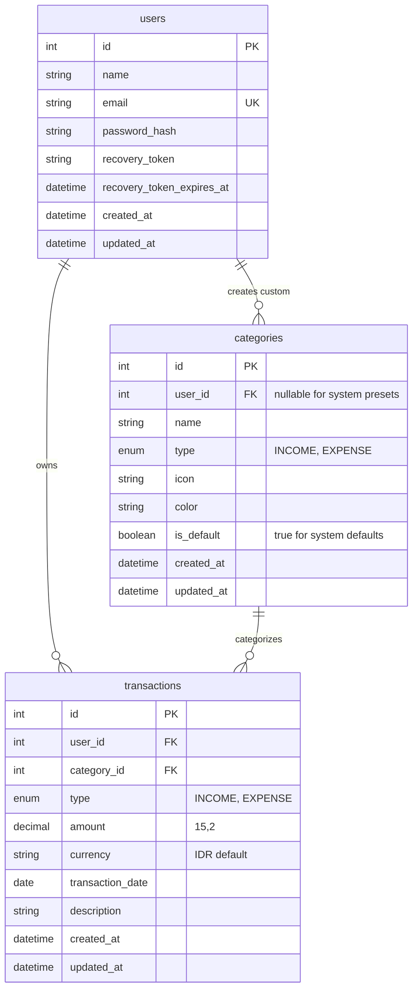

# Database Plan — Personal Finance Web App (FinReport)

> **Status:** APPROVED — Database Schema Design
> **Engine:** MySQL 8.0+
> **ORM:** Prisma ORM

---

## 1. Naming Conventions & Standard
- Nama tabel: `snake_case` jamak (contoh: `users`, `categories`, `transactions`).
- Primary key: `id` (INT Auto-Increment atau UUID/CUID).
- Foreign key: `{nama_tabel_tunggal}_id` (contoh: `user_id`, `category_id`).
- Timestamps: `created_at` dan `updated_at` di setiap tabel.

---

## 2. Entity Relationship Diagram (ERD)

---

## 3. Detail Skema Tabel

### 3.1 Tabel `users`
| Kolom | Tipe Data | Constraint | Deskripsi |
|-------|-----------|------------|-----------|
| `id` | INT | Primary Key, Auto Increment | Identifier unik pengguna |
| `name` | VARCHAR(100) | NOT NULL | Nama lengkap pengguna |
| `email` | VARCHAR(191) | NOT NULL, UNIQUE | Alamat email untuk login |
| `password_hash` | VARCHAR(255) | NOT NULL | Password terenkripsi bcrypt |
| `recovery_token` | VARCHAR(100) | NULLABLE | Kode PIN / token verifikasi pemulihan reset password |
| `recovery_token_expires_at` | DATETIME | NULLABLE | Waktu kedaluwarsa token pemulihan |
| `created_at` | DATETIME | DEFAULT CURRENT_TIMESTAMP | Waktu pembuatan akun |
| `updated_at` | DATETIME | ON UPDATE CURRENT_TIMESTAMP | Waktu modifikasi terakhir |

### 3.2 Tabel `categories`
| Kolom | Tipe Data | Constraint | Deskripsi |
|-------|-----------|------------|-----------|
| `id` | INT | Primary Key, Auto Increment | Identifier kategori |
| `user_id` | INT | NULLABLE, FK(`users.id`) ON DELETE CASCADE | Pemilik kategori (NULL = kategori default sistem) |
| `name` | VARCHAR(100) | NOT NULL | Nama kategori (misal: "Makanan", "Gaji") |
| `type` | ENUM('INCOME', 'EXPENSE') | NOT NULL | Jenis kategori |
| `icon` | VARCHAR(50) | DEFAULT 'tag' | Ikon penanda (Lucide icon identifier) |
| `color` | VARCHAR(20) | DEFAULT '#6B7280' | Kode warna hex untuk visual chart |
| `is_default` | BOOLEAN | DEFAULT FALSE | Penanda kategori bawaan sistem |
| `created_at` | DATETIME | DEFAULT CURRENT_TIMESTAMP | Waktu pencatatan |
| `updated_at` | DATETIME | ON UPDATE CURRENT_TIMESTAMP | Waktu perubahan |

### 3.3 Tabel `transactions`
| Kolom | Tipe Data | Constraint | Deskripsi |
|-------|-----------|------------|-----------|
| `id` | INT | Primary Key, Auto Increment | Identifier unik transaksi |
| `user_id` | INT | NOT NULL, FK(`users.id`) ON DELETE CASCADE | Pemilik transaksi |
| `category_id` | INT | NOT NULL, FK(`categories.id`) ON DELETE RESTRICT | Kategori transaksi |
| `type` | ENUM('INCOME', 'EXPENSE') | NOT NULL | Jenis arus kas |
| `amount` | DECIMAL(15,2) | NOT NULL | Nominal uang |
| `currency` | VARCHAR(10) | DEFAULT 'IDR' | Kode mata uang |
| `transaction_date` | DATE | NOT NULL | Tanggal transaksi terjadi |
| `description` | VARCHAR(255) | NULLABLE | Catatan / rincian transaksi |
| `created_at` | DATETIME | DEFAULT CURRENT_TIMESTAMP | Timestamp catatan masuk sistem |
| `updated_at` | DATETIME | ON UPDATE CURRENT_TIMESTAMP | Timestamp pembaruan catatan |

---

## 4. Indexing & Optimization Strategy
- `idx_transactions_user_date`: Index gabungan pada `(user_id, transaction_date)` untuk mempercepat filter rentang tanggal dan kalkulasi saldo berjalan.
- `idx_transactions_user_category`: Index pada `(user_id, category_id)` untuk agregasi pengeluaran per kategori pada chart.
- `idx_categories_user_type`: Index pada `(user_id, type)` untuk query daftar dropdown kategori yang cepat.

---

## 5. Seed Data Bawaan (Default Categories)
- **Pemasukan (INCOME)**: Gaji (*Salary*), Bonus, Investasi & Dividen, Pendapatan Usaha, Lainnya.
- **Pengeluaran (EXPENSE)**: Makanan & Minuman, Transportasi, Tempat Tinggal & Sewa, Tagihan & Utilitas, Belanja Kebutuhan, Hiburan & Rekreasi, Kesehatan & Medis, Pendidikan, Donasi / Amal, Lainnya.

---

## 6. Perubahan Skema Post-MVP (PROPOSED)
Tabel baru `accounts`, `import_batches`, `category_rules`; kolom baru `account_id`, `transfer_group_id`, `import_batch_id`, `import_fingerprint` pada `transactions`; enum TransactionType + TRANSFER_IN/TRANSFER_OUT. Detail: `planning/bank-import.md` bagian 7.
